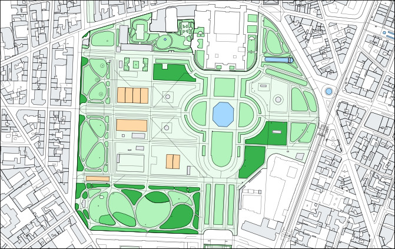

Projet OpenStreetMap
================================================================================

  

📍 Coordonnées GPS
--------------------------------------------------------------------------------

  - Contexte

  - Conversion en degrés décimaux

  - Conversion en degrés, minutes, secondes (et direction cardinale)

  - Représentation comme chaîne de caractères

🗺️ Cartographie avec Folium
--------------------------------------------------------------------------------

  - Contexte

  - Cartes

  - Centrage & Zoom

  - Infobulles

📷 Photographie & Géolocalisation
--------------------------------------------------------------------------------

  - Contexte

  - Exploration des métadonnées

  - Géolocalisation

🗂️ Structure des cartes OpenStreetMap
--------------------------------------------------------------------------------

  - Contexte (XML)

  - Conversion en dictionnaire

  - Profondeur

  - Types

  - Itération (en profondeur)

  - Schéma

  - Règles structurelles

🔎 Recherche dans les cartes
--------------------------------------------------------------------------------

  - Recherche par identifiant et type

  - Recherche par couple clé/valeur

  - Performance et Indexation

🖌️ Tracé des cartes
--------------------------------------------------------------------------------

  - Extraction des géométries

  - Tracé brut

  - Boîte englobante

  - Projection (pseudo-Mercator)

  - Types de terrain

  - Colorisation
